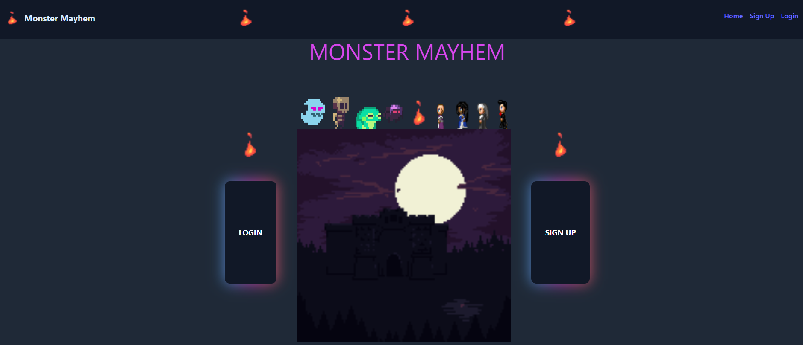
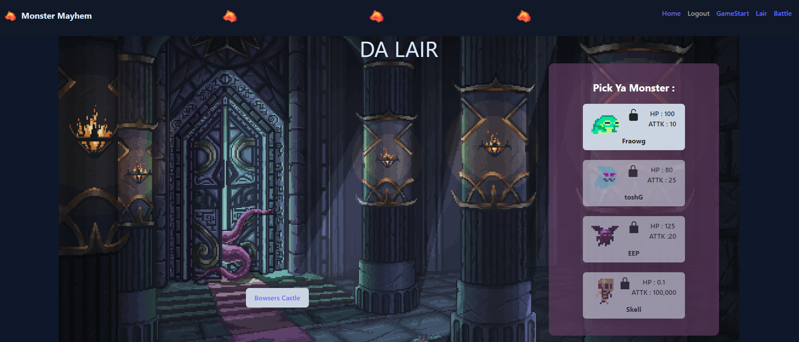
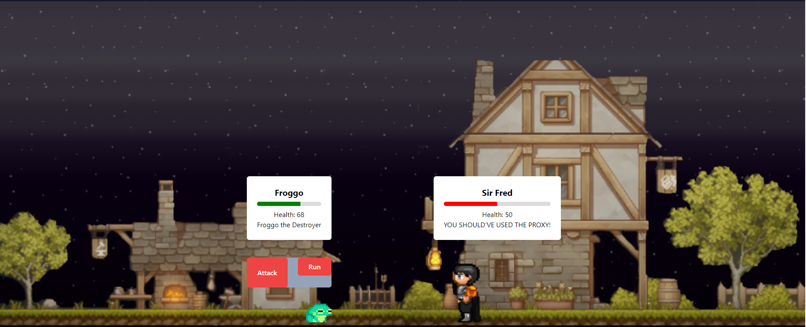

# Monster Mayhem

  

## Description
This is a MERN stack project where you can sign up, choose a monster, and fight in a battle versus non player characters in turn based battles.

## Table of Contents
- [Installation](#installation)
- [Usage](#usage)
- [License](#license)
- [Contributing](#contributing)
- [Tests](#tests)
- [Author](#author)

## Installation
Go to website and log in

## Usage

## [Live Site](https://calm-meadow-66160-5c84b96ef414.herokuapp.com/)

## License

Copyright (c) 2023 Mitchell Wandall

Permission is hereby granted, free of charge, to any person obtaining a copy
of this software and associated documentation files (the "Software"), to deal
in the Software without restriction, including without limitation the rights
to use, copy, modify, merge, publish, distribute, sublicense, and/or sell
copies of the Software, and to permit persons to whom the Software is
furnished to do so, subject to the following conditions:

The above copyright notice and this permission notice shall be included in all
copies or substantial portions of the Software.

THE SOFTWARE IS PROVIDED "AS IS", WITHOUT WARRANTY OF ANY KIND, EXPRESS OR
IMPLIED, INCLUDING BUT NOT LIMITED TO THE WARRANTIES OF MERCHANTABILITY,
FITNESS FOR A PARTICULAR PURPOSE AND NONINFRINGEMENT. IN NO EVENT SHALL THE
AUTHORS OR COPYRIGHT HOLDERS BE LIABLE FOR ANY CLAIM, DAMAGES OR OTHER
LIABILITY, WHETHER IN AN ACTION OF CONTRACT, TORT OR OTHERWISE, ARISING FROM,
OUT OF OR IN CONNECTION WITH THE SOFTWARE OR THE USE OR OTHER DEALINGS IN THE
SOFTWARE.

## Credits
Zechiel Lozer, Mitchell Wandall, and Conor Reed.

## Tests
NA

## Author
- **Mitchell Wandall**
  - Feel free to use this code. If you have any suggestions or would like to see more of my work, please check out my [Github](https://github.com/MWandall).
